**Note:** For the screenshots, you can store all of your answer images in the `answer-img` directory.

## Verify the monitoring installation
*TODO:* run `kubectl` command to show the running pods and services for all components. Take a screenshot of the output and include it here to verify the installation
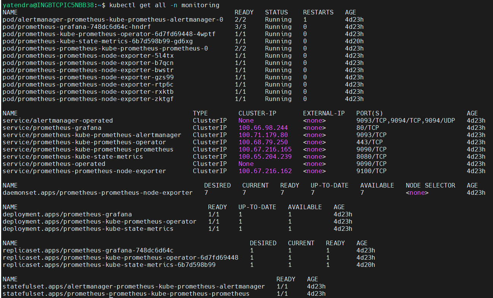
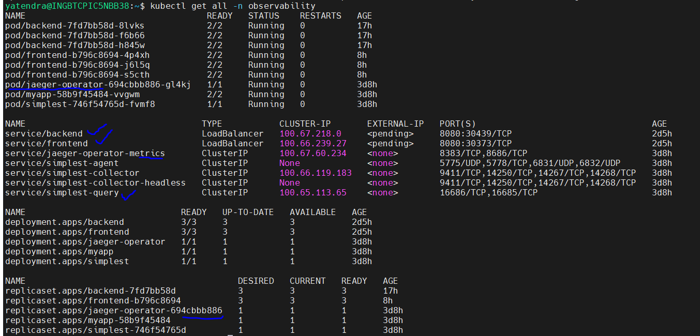

## Setup the Jaeger and Prometheus source
*TODO:* Expose Grafana to the internet and then setup Prometheus as a data source. Provide a screenshot of the home page after logging into Grafana.
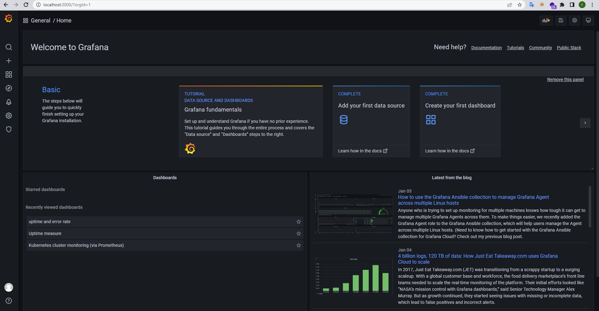

## Create a Basic Dashboard
*TODO:* Create a dashboard in Grafana that shows Prometheus as a source. Take a screenshot and include it here.
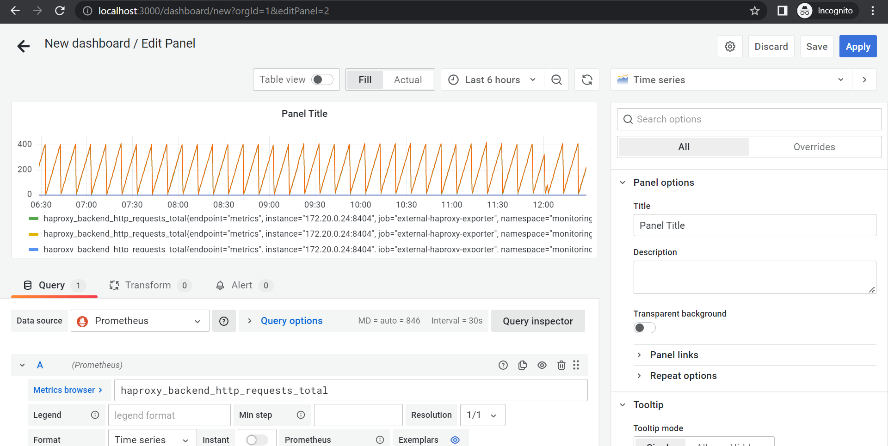

## Describe SLO/SLI
*TODO:* Describe, in your own words, what the SLIs are, based on an SLO of *monthly uptime* and *request response time*.
SLI: The real numbers on your performance.
SLO: The objectives your team must hit to meet that agreement.
  SLA          						SLO 						SLI
Promise		   					    Goal						How did we do?
SLI and SLO used for making a site reliable.
we can check reliability matrics four signals for site or application reliable:
Latency
Error rate
Traffic
Saturation

## Creating SLI metrics.
*TODO:* It is important to know why we want to measure certain metrics for our customer. Describe in detail 5 metrics to measure these SLIs. 
Latency: It is the delay time observation . It mean low latency is good as compare to high latency in application response or requests.
Availability: It is time for declaration of availability. high avaialbility is good in application deployment. Application should ready for handle request and response in given time.
Error rate: It is the ratio of {wrong response}/{total response} of an application server.
Throughput: It is ratio of number of {handle request}/{Total number of request comes}
Response time: It is the minimum time to response of a request by server.
Durability: It is the time in which application should work properly and give desired output as per request. 

## Create a Dashboard to measure our SLIs
*TODO:* Create a dashboard to measure the uptime of the frontend and backend services We will also want to measure to measure 40x and 50x errors. Create a dashboard that show these values over a 24 hour period and take a screenshot.
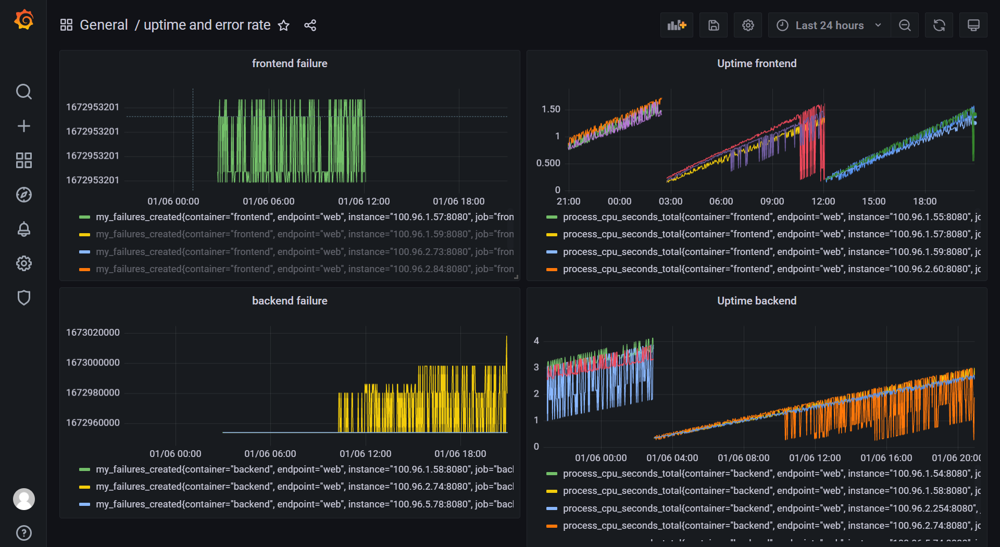

## Tracing our Flask App
*TODO:*  We will create a Jaeger span to measure the processes on the backend. Once you fill in the span, provide a screenshot of it here. Also provide a (screenshot) sample Python file containing a trace and span code used to perform Jaeger traces on the backend service.

## Jaeger in Dashboards
*TODO:* Now that the trace is running, let's add the metric to our current Grafana dashboard. Once this is completed, provide a screenshot of it here.

## Report Error
*TODO:* Using the template below, write a trouble ticket for the developers, to explain the errors that you are seeing (400, 500, latency) and to let them know the file that is causing the issue also include a screenshot of the tracer span to demonstrate how we can user a tracer to locate errors easily.

TROUBLE TICKET

Name: Getting response from endpoint

Date: 05-01-2023

Subject: Exploring 500 error with Jaeger Tracer

Affected Area: In Jaeger trecable application , there is one endpoint ('/star') has problem related to 'POST' methods.

Severity: The defect has moderate priority because we are unable to achieve desired response and unable to implement it successfully.

Description: We are unable to trace this function with 'POST' methods and If we change this 'POST' method to 'GET' then we have error in this code but now Jaeger is able to trace it and give the logs of error:
 

## Creating SLIs and SLOs
*TODO:* We want to create an SLO guaranteeing that our application has a 99.95% uptime per month. Name four SLIs that you would use to measure the success of this SLO.

Here the SLOs is that our application has 99.95% uptime per month.

For that,I try to measure the four signals:

  1. Percentage of CPU and memory consumption in the last 1 month (for saturation).
  2. Percentage of Infrastructure uptime in the last 1 month (for error).
  3. The average number of requests per minute in the last 24 hours (for traffic).
  4. Percentage of request response time less than 250 milliseconds (for latency).

We also need some errors budget because all applications will not always work perfectly.
  1. Our application will produce 5xx status code less than 1% in a month
  2. Service downtime will be 0.001% in next month.

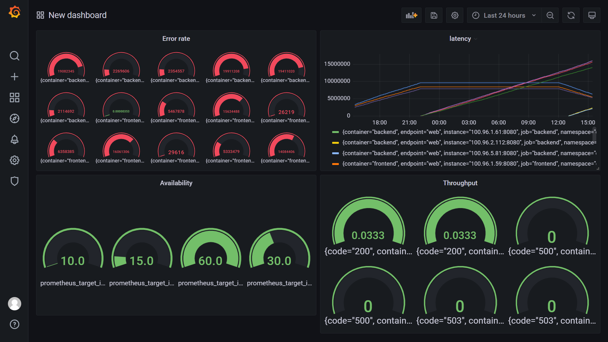

## Building KPIs for our plan
*TODO*: Now that we have our SLIs and SLOs, create a list of 2-3 KPIs to accurately measure these metrics as well as a description of why those KPIs were chosen. We will make a dashboard for this, but first write them down here.
KPIs is a type of report which describe point of view such a way so that User can understand easily.
Here we describe two KPIs point.
1. latency : It is the measurement of delay between requests and response of an application.
			 For latency we can use Two way either measure the time of processing of individual endpoint of application or use Prometheus library (Histogram or Summary).
			 Here we are using Prometheus library directly called Histogram.
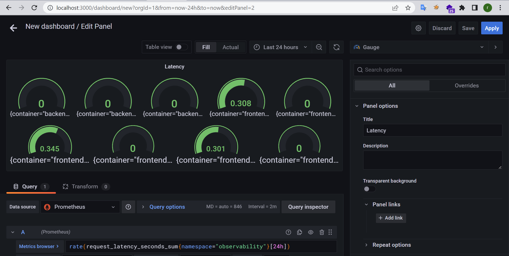
2. Error rate : It is defined as (invalid response)/(total requests)
				In our KPIs we are finding as (failure_total)/(total_requests)
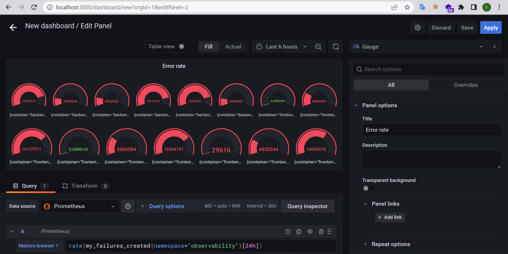

To achieve our SLO, I would collect KPIs everyday

1. CPU consumption should be less than 80%.
2. Memory consumption should be less than 80%.
3. Percentage of infrastructure uptime should be higher than 99.99%.
4. There should not be any 500 errors in the last 1 hour.
5. Average number of requests per minute should be less than 50.

## Final Dashboard
*TODO*: Create a Dashboard containing graphs that capture all the metrics of your KPIs and adequately representing your SLIs and SLOs. Include a screenshot of the dashboard here, and write a text description of what graphs are represented in the dashboard.  

Here

1. CPU utilization for all services about 31% which is less that 80%. 80% is our warning limit.
2. Also there is individual service cpu utilization graph which help us to determine which service need more CPU.
3. Memory utilization for my cluster is ~67% for all the services where total memory size 4GB.
4. Same as CPU, there is also individual service memory utilization graph.
5. There is also a service availability metrics, which shows our service availability 100% last one hour.
6. Also shows the request latency

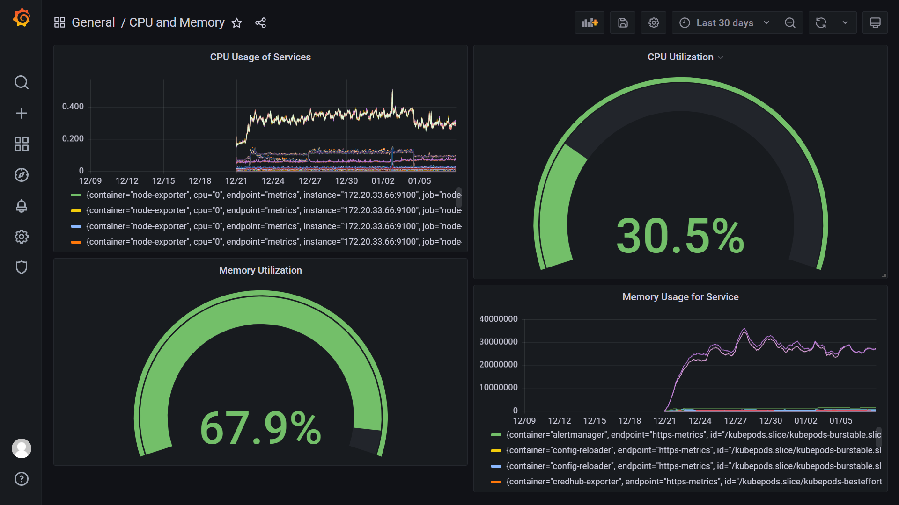

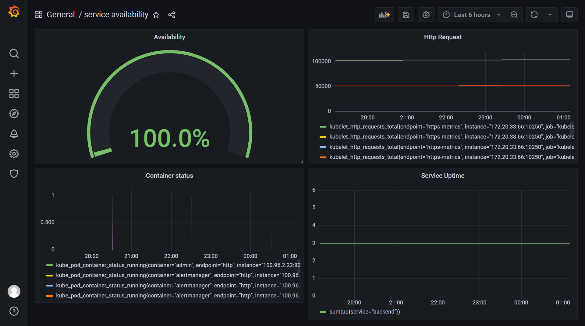

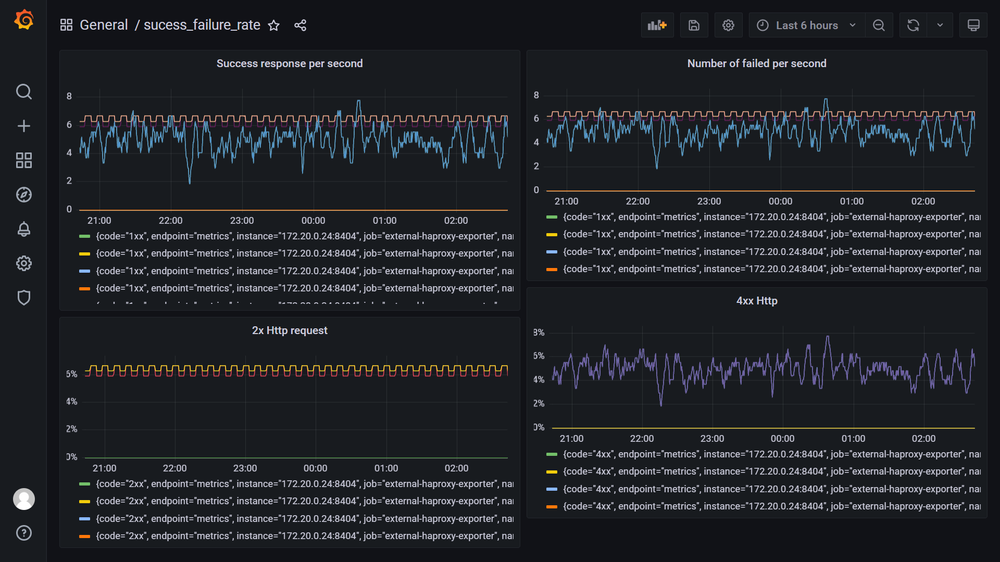
